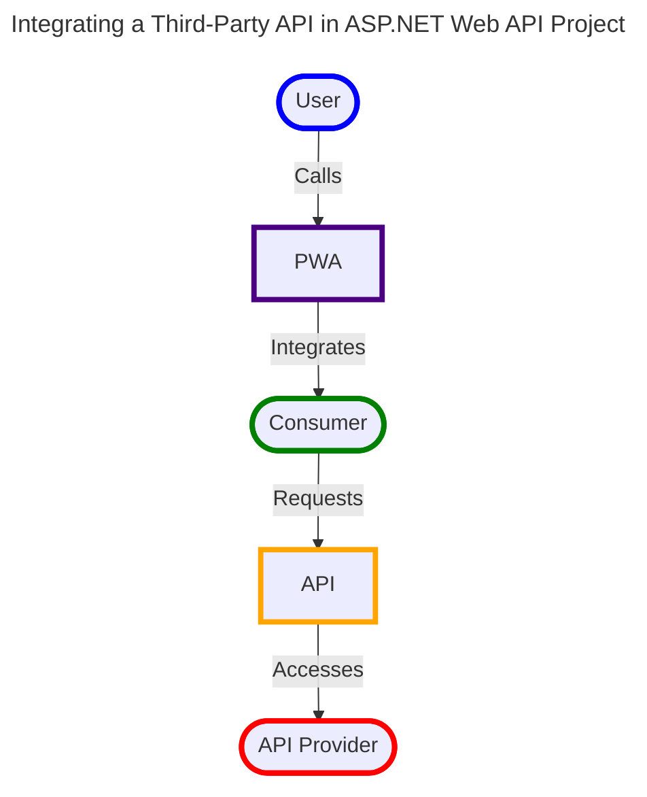

# bronto
:sauropod:Bronto is a Progressive Web Application (PWA) that accesses stock market data using .NET 8 and Blazor.

### Demo
The image shows Blazor WASM application execution.\

### Design - Overview

 ### Design - Structure
    Solution
    │     
    ├── Presentation PWA               <- The project UI logic.
    │   └── Pages
    │       └── Stock.cs
    │
    ├── Presentation API               <- The project API logic.
    │   └── Controllers
    │       └── StockController.cs
    │
    ├── Application                    <- The project services (use cases/features).
    │   └── Services
    │       └── StockServices.cs
    │
    ├── Domain                         <- The project business logic.
    │   ├── Entities/Models
    │   │   └── Stock.cs
    │   ├── Interfaces
    │   └── Shared
    │
    ├── Infrastucture                  <- The project infrastructure.
    │   ├── Data
    │   │   └── StockData.cs
    │   ├── HttpClients
    │   │   └── StockCient.cs
    │   └── Caching
    │
    ├── Tests             	           <- The project Unit tests for each layer.
    │   ├── ApplicationTests
    │   ├── DomainTests
    │   └── InfrastructureTests    
    │
    ├── Bronto.sln
    └── README.md

